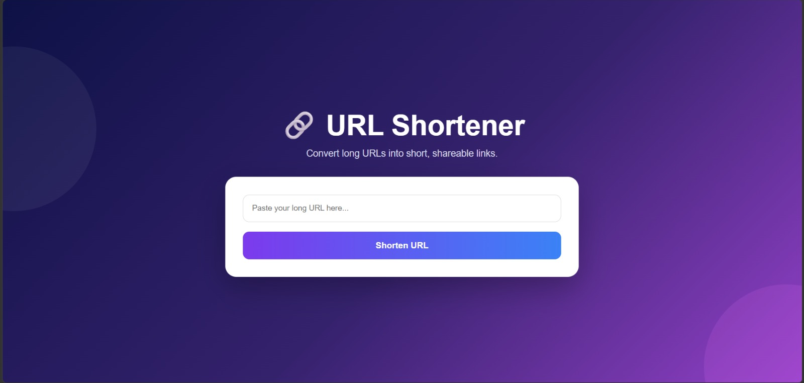
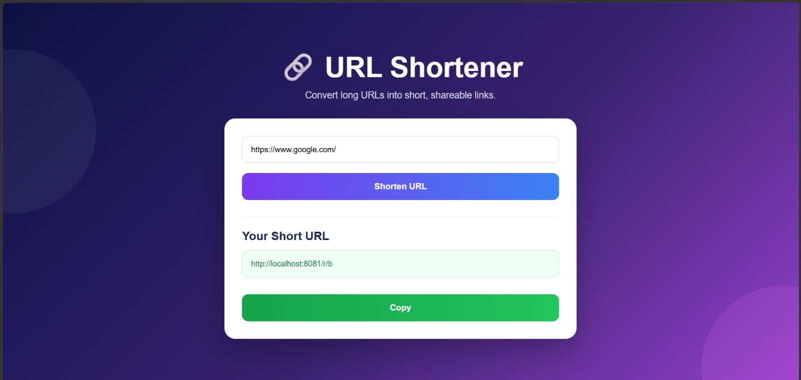
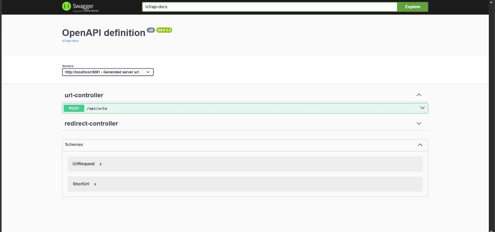
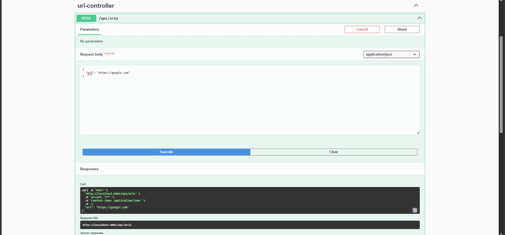
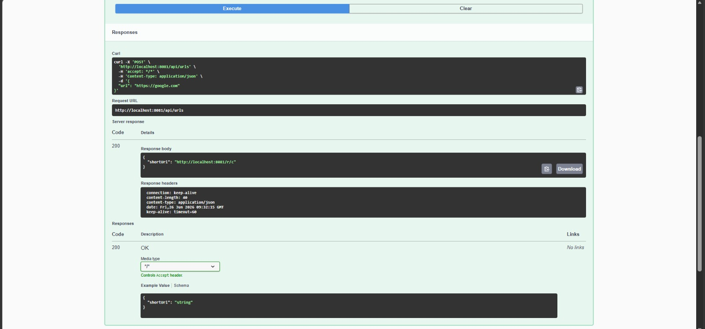

# 🔗 URL Shortener API

**Java • Spring Boot • REST API • JPA • H2 Database • Swagger UI**

---

# 🚀 RESTful URL Shortener API

A production-style URL Shortener built using **Spring Boot** that converts long URLs into compact, shareable links.

The application generates unique short codes using **Base62 encoding**, stores mappings in an **H2 database**, and redirects users to the original destination while maintaining a clean layered architecture.

It also includes an intuitive frontend interface and complete API documentation using **Swagger UI**.

---

## 🌟 Why This Project?

Long URLs are difficult to share, remember, and manage.

This project demonstrates how backend development concepts such as REST APIs, database persistence, layered architecture, and URL redirection can be combined to build a practical real-world application similar to Bit.ly or TinyURL.

---

# ✨ Features

* 🔗 Convert long URLs into short links
* 🚀 Instant URL redirection
* 🎨 Responsive Frontend Interface
* 📚 Interactive Swagger API Documentation
* 💾 H2 In-Memory Database
* 🏗️ Layered Spring Boot Architecture
* 🔄 RESTful API Design
* 🔑 Base62 Short Code Generation
* ⚡ Lightweight and Fast
* ✅ Input Validation & Error Handling

---

# 🏗️ Project Workflow

```
Long URL
     │
     ▼
Frontend / Swagger Request
     │
     ▼
Spring Boot REST API
     │
     ▼
Generate Base62 Short Code
     │
     ▼
Store URL Mapping (H2 Database)
     │
     ▼
Return Short URL
     │
     ▼
User Opens Short URL
     │
     ▼
Redirect to Original Website
```

---

# 📋 API Endpoints

| Method | Endpoint    | Description                  |
| ------ | ----------- | ---------------------------- |
| POST   | `/api/urls` | Generate a short URL         |
| GET    | `/r/{code}` | Redirect to the original URL |

---

# 🛠️ Technology Stack

| Technology                 | Purpose               |
| -------------------------- | --------------------- |
| ☕ Java 17                  | Programming Language  |
| 🌱 Spring Boot             | Backend Framework     |
| 🗄️ Spring Data JPA        | Database Access       |
| 💾 H2 Database             | Data Storage          |
| 📖 Swagger UI              | API Documentation     |
| 🎨 HTML • CSS • JavaScript | Frontend              |
| 🔧 Maven                   | Dependency Management |

---

# 📷 Project Screenshots

## 🏠 Home Page

The landing page where users can enter a long URL to generate a shortened link.



---

## 🔗 Generated Short URL

After submitting a valid URL, the application instantly generates a short, shareable link.



---

## 📚 Swagger API Documentation

Interactive API documentation provided by Swagger UI for testing all available endpoints.



---

## 🚀 Create Short URL Request

Example of sending a POST request through Swagger UI to create a new short URL.



---

## ✅ API Response

Successful API response returning the generated shortened URL.



# 📂 Project Structure

```text
url-shortener-api/
│
├── src/
├── images/
│   ├── home.png
│   ├── generated-url.png
│   ├── swagger-overview.png
│   ├── create-api-request.png
│   └── create-api-response.png
│
├── pom.xml
├── README.md
└── mvnw
```

# ⚙️ Installation

Clone the repository

```bash
git clone https://github.com/parthmandore/url-shortener-api.git
```

Navigate to the project

```bash
cd url-shortener-api
```

Run the application

```bash
./mvnw spring-boot:run
```

Open in your browser

```
Application
http://localhost:8081

Swagger UI
http://localhost:8081/swagger-ui/index.html
```

---

# 🧪 Example Request

```json
{
  "url": "https://www.google.com"
}
```

### Response

```json
{
  "shortUrl": "http://localhost:8081/r/c"
}
```

---

# 🔮 Future Improvements

* 🌐 MySQL/PostgreSQL Support
* 👤 User Authentication
* 📊 URL Analytics Dashboard
* 📈 Click Statistics
* ⏳ URL Expiration
* 🔐 Custom Short URLs
* ☁️ Docker Deployment
* 🚀 Cloud Deployment (AWS/GCP)

---

# ⚠️ Limitations

* Uses an H2 in-memory database (data resets when the application stops).
* Base62 short codes are generated sequentially.
* No authentication or user management.
* Analytics and expiration features are not implemented yet.

---

# 👨‍💻 Author

**Parth Mandore**

Built with ❤️ using **Java, Spring Boot, REST APIs, and JPA**.

If you found this project helpful, consider giving it a ⭐ on GitHub!
